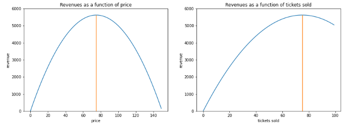

# Pricing-optimization-Model
Optimize revenues through pricing algorithm in python - Demand with uniform distribution

# Problem statement
This problem is inspired by a micro challenge proposed at [Kaggle](https://www.kaggle.com/alexisbcook/airline-price-optimization-microchallenge).

The objective is to optimize generated revenues using dynamic pricing by defining a pricing algorithm able to predict and optimize daily prices in response to a changing daily demand. Think about a transportation, hospitality or entertainment industry selling a fixed amount of tickets for a defined event, flight or time-bound service. 

For each event, the pricing function will be run once per day to set that day's ticket price. The seats you don't sell today will be available to sell tomorrow, unless the date of event is reached (for example, the flight leaves that day).

Key problem assumptions:
- Demand is represented by a uniform distribution between 100 and 200. So, for any day in the future, it is equally likely to be each value between 100 and 200 (the demand has equal probabilities to occur).
- You only learn the demand level for each day at the time you need to define price for that day.
- Ticket quantities are capped at the number of seats available.
- Tickets which have not been sold at the date of the event are lost.
- The quantity of tickets you sell on a given day is defined by the simple equation: `tickets sold = demand - price (on that day)`. So you won't sell any tickets if priced at the demand level (walk-away price limit) and you will sell all available tickets if you propose a price equals to the demand less your number of tickets (provided the demand is large enough).
- The sale starts N days before the event with a defined number of tickets to sell. The objective is to maximize revenues generated selling the tickets.

# Initial observations
- Since unsold tickets are lost, the algorithm must check and sell all remaining tickets the day before the last. This will be achieved by setting price = demand - tickets left. In case the demand on the day before the last is below the number of tickets left, a portion will be lost. 

- Revenues = Price x Quantities sold.
  - Quantities sold = demand - price
  - `Revenues = price x (demand - price)`. Similarly, `Revenues = tickets_sold x (demand - tickets_sold)`. Revenues are maximized when the function's derivative is 0.
  - dRevenues/dprice = demand - 2 x price so the optimal price maximizing Revenues is `price* = demand / 2`.
  - Given revenue formula, we find back that we do not generate revenues if price = 0 or if price = demand.
  
-  At optimal price, ticket_sold* = demand - price* = demand - demand/2 = demand/2.
    - This optimal price is only relevant when the number of available tickets is at least half of the demand.
    - The price should not be lower than demand - remaining number of tickets
    - Below are the revenue function of price or tickets sold assuming demand = 150 and max tickets of 100.
    

    
- Let's test different strategies:
  - If we try to sell a lot of tickets when demand is high, the outcome can be sub-optimal. Let's take a demand level of 180, close to the max 200. let's assume we have 30 tickets left. In case we are a couple of days before departure, the probability to get a higher demand level is reduced because it needs to be higher than the current demand and there are very few days (or opportunities) left. So this makes sense to try selling all remaining tickets.
    - price = demand - tickets left, ie price = 180 - 30 = 150 ===> Revenues = 150 x 30 = 4500.
  - However let's imagine we have many days left before the event. What should we do ? In fact, we could achieve similar revenues by fractioning the sales and create opportunities to outperform:
    - let's sell only 15 tickets when demand is 180. price is improved by 15 at 180 - 15 = 165 ==> Revenues = 165 x 15 = 2475.
    - we need another day with demand of 150 only to equal the first strategy: Let's sell the remaining 15 tickets with a lower demand of 150. price = 150 - 15 = 135 ==> Revenues = 135 x 15 = 2025. Total revenues = 2475 + 2025 = 4500 similar to our first strategy.
    - However we have created opportunities to outperform. If we can sell the 15 remaining tickets with any demand higher than 150 (basically 50% chance to occur) then we will gain from a higher price.
  - Conclusion => **The logic should not to sell the maximum number of tickets when demand is high but rather sell smaller amounts of tickets at a higher price with high demand, rinse and repeat until the last days before the event. This is the optimization opportunity**.
  
- Since the demand obeys to a uniform distribution, we can calculate a few probabilities, which will be help overall understanding later on: 
     - Probability to get a demand level D: P(D) = 1/101 (there are equals chances to take integer values from 100 to 200 included)
     - Probability that we get a demand higher than level D: P(demand > D) = (200 - D) / 101 with the demand taking all values between 100 to 200. We can check that P(demand>100) = 99%, P(demand>200) = 0 and P(demand>150) close to 50%.
     - Demand Expectation E(demand) = sum(p(d) x d with d taking all values between 100 to 200) = 1/101 * sum(d with d within 100-200) = 1/101 * 101 x 300 / 2 = 150

# Proposed approach
In the notebook, I first propose basic price calculations. These achieves increasing results as we segment to increase opportunities to outperform. The best approach delivers **€7,348** per event on average on the test dataset. 

Then I use a more sophisticated algorithm using brute force. The algorithm precomputes all possible best prices given the number of days left and the number of tickets left accross all possible demand levels. The average revenue is increased to **€7,574**, a 3% improvement over previous best result.

Finally I use a refined version of the brute force approach proposed [here](https://www.kaggle.com/aliaksei0/airline-price-optimization-micro-challenge) delivering a further improvement to **€7,596**. This solution uses an optimization technique called dynamic programming. Dynamic programming starts by solving an optimization problem in a very limited scenario, and then creates an iterative rule to expand to larger problem. In our case, we first solve for the optimal price when you only have 1 day to sell tickets before the flight. Then we continually step back to longer time-horizons one day at a time.
  
# Next Steps
Use Bellmann equation to calculate average revenues. Using this equation allows to achieve an average revenue of **€7,611** on the test dataset (see [here](https://www.kaggle.com/ivannz/airline-price-optimization-micro-challenge-d76dba/)).

The Bellman equation shows up everywhere in the Reinforcement Learning literature, being one of the central elements of many Reinforcement Learning algorithms. In summary, we can say that the Bellman equation decomposes the value function into two parts, the immediate reward plus the discounted future values.

This equation simplifies the computation of the value function, such that rather than summing over multiple time steps, we can find the optimal solution of a complex problem by breaking it down into simpler, recursive subproblems and finding their optimal solutions.
